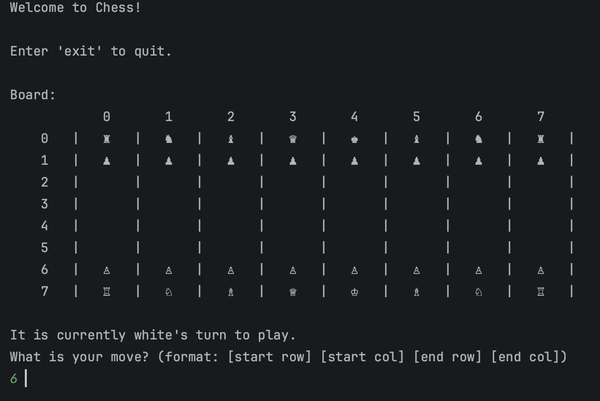

# Terminal Chess Master



## Description

> C++ program enabling chess play in the terminal. Designed for simplicity and engagement, catering to players of all levels. Highlights object-oriented programming principles for a structured and modular chess environment.

## Features

- Move validation based on chess rules.
- Piece-specific move logic (Pawn, Rook, Knight, Bishop, Queen, King).
- Simple command-line interface for user interactions.
- Basic board representation and visualization.

## How to Install and Run the Project

- Clone the repository to your local machine.
  - `git clone https://github.com/curtiskokuloku/Chess.git`
- Navigate to the project directory.
  - `cd Chess/app`
- Compile the source files using a C++ compiler.
  - `g++ main.cpp -o main`
- Execute the compiled program to start the chess game.
  - `./main`

## How to Use the Project

> Once you've successfully compiled and run the program, follow the on-screen instructions
> to navigate through the game.
> Use the command-line interface to input your moves in the specified format.

Example

```bash
What is your move? (format: [start row] [start col] [end row] [end col])
```

## Credits

> Developed by Curtis Kin Kokuloku
---
02/2022
